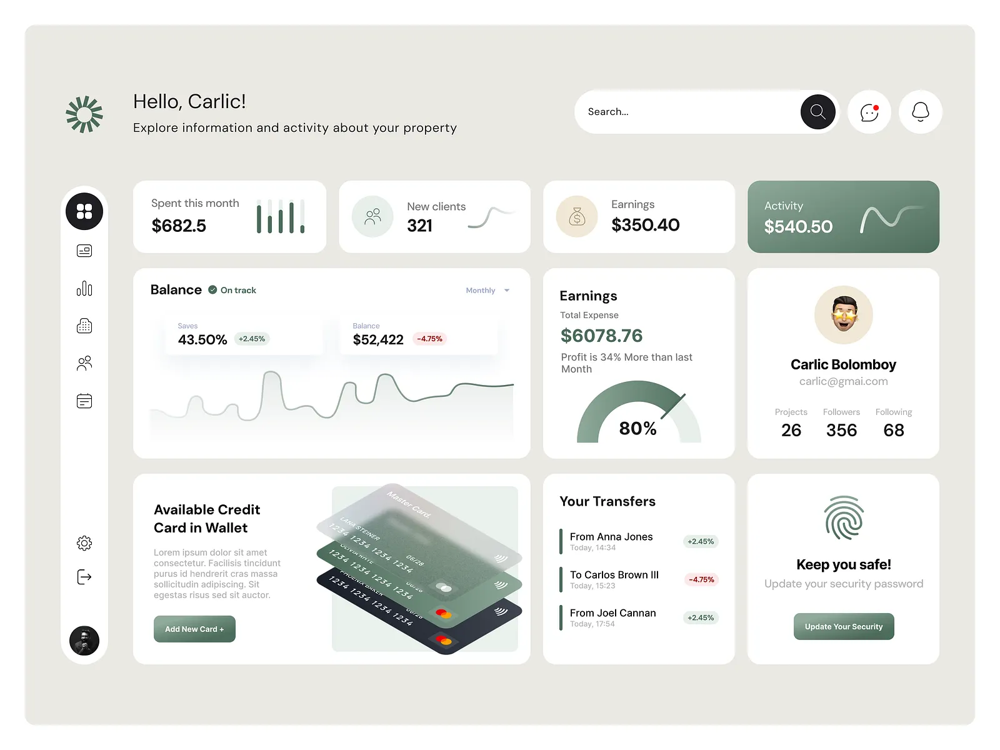

# aliens-made-this

Playful capability test: take design inspiration → ship pixel-perfect static HTML.

**Live site:** [kvnloo.github.io/aliens-made-this](https://kvnloo.github.io/aliens-made-this/)

## Lineage

Started after finding **[Alien Interfaces](https://alieninterfaces.com/)** — CJ Gammon’s collection of AI-designed UIs plus a [YouTube series](https://www.youtube.com/playlist?list=PL08jItIqOb2oMXWRZTPua0nC3oZ6Stoul) walking Midjourney (etc.) into real pages.

- Site: [alieninterfaces.com](https://alieninterfaces.com/)
- Playlist: [Alien Interfaces on YouTube](https://www.youtube.com/playlist?list=PL08jItIqOb2oMXWRZTPua0nC3oZ6Stoul)
- Background: [CJ’s write-up](https://blog.cjgammon.com/alien-interfaces-ui-ux-created-with-ai/)

This repo is a personal playground in that spirit: stash inspo, clone to static HTML, show inspo ↔ demo side by side on GH Pages (`index.html`).

## Showcase (with original local inspo)

| Demo | Original inspo | Notes |
|------|----------------|--------|
| [`pixel-perfect/dashboard.html`](pixel-perfect/dashboard.html) | [`inspo/original-a16c4c….webp`](inspo/original-a16c4c2967229fa52683443ee0c26903.webp) | Hello, Carlic! fintech dashboard |
| [`pixel-perfect/dashboard_uied.html`](pixel-perfect/dashboard_uied.html) | same as above | Alternate implementation pass |
| [`pixel-perfect/data-viz-dashboard.html`](pixel-perfect/data-viz-dashboard.html) | [`inspo/Fjm_ePFVEAIb2zq.jpeg`](inspo/Fjm_ePFVEAIb2zq.jpeg) | Mountain landscape analytics |
| [`pixel-perfect/01.html`](pixel-perfect/01.html) | [`inspo/01.jpg`](inspo/01.jpg) | Glassmorphic pastel mobile |
| [`pixel-perfect/isometric-landing-page.html`](pixel-perfect/isometric-landing-page.html) | [`inspo/Lookasz_….png`](inspo/Lookasz_use_colors_from_link_landing_page_with_buttons_and_larg_96dc354a-d397-461f-93a3-ef2ba1ad7f4e.png) | Isometric 3D gem cards |
| [`pixel-perfect/motherduck.html`](pixel-perfect/motherduck.html) | *(live site)* | Brutalist MotherDuck-style landing |
| [`pixel-perfect/trading.html`](pixel-perfect/trading.html) | *(none checked in)* | Alpha Arena trading UI |
| [`pixel-perfect/harness.html`](pixel-perfect/harness.html) | *(live site)* | Harness-inspired SaaS marketing |

Financial dashboard reference:



## Layout

```
.
├── index.html              # GH Pages gallery (inspo ↔ demo + lineage)
├── .nojekyll
├── inspo/                  # local reference images
├── pixel-perfect/          # static HTML implementations
└── README.md
```

Open demos locally with any static server, e.g. `python -m http.server 8000`.

## License

See [LICENSE](LICENSE). Not affiliated with Alien Interfaces / CJ Gammon — just inspired by the series.
