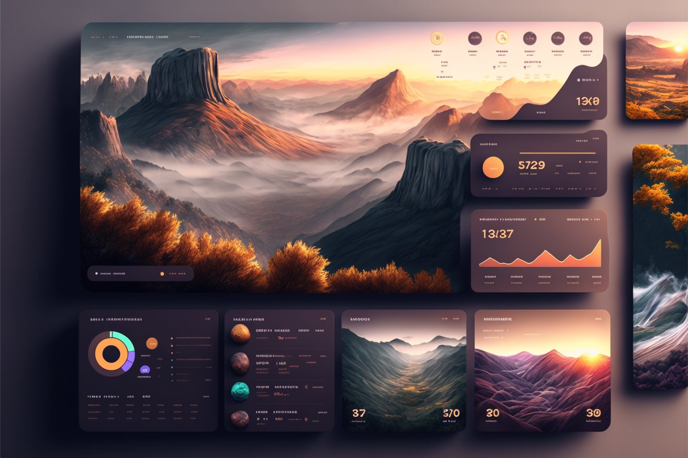

# 🎨 Pixel-Perfect UI Implementations
### AI-Assisted Frontend Development Showcase

> **A portfolio showcasing advanced AI-assisted workflows for transforming design inspiration into production-ready, pixel-perfect UI implementations.**

This repository demonstrates sophisticated frontend development capabilities using AI-assisted workflows to create production-quality UI implementations across diverse design systems—from brutalist to glassmorphism, from financial dashboards to creative interfaces.

---

## 📱 Showcase

### 1. **Financial Dashboard**


**Design Style:** Modern Analytics Dashboard with Landscape Visuals
**Tech Stack:** HTML5, Tailwind CSS, Lucide Icons, Custom CSS Variables
**Features:**
- Responsive grid layout with glassmorphism cards
- Interactive metric visualizations
- Custom color theming system
- Smooth animations and hover states
- Pixel-perfect component spacing

**Implementation:** [`pixel-perfect/dashboard.html`](pixel-perfect/dashboard.html)

**Key Technical Highlights:**
- 945 lines of production-ready code
- Custom CSS variable system for consistent theming
- 6px hard-shadow brutalist accents
- Fully responsive (mobile → tablet → desktop)
- Semantic HTML5 structure

---

### 2. **MotherDuck Brutalist Landing**
**Design Style:** Bold Brutalist Design System
**Tech Stack:** HTML5, Tailwind CSS, Space Mono Typography
**Features:**
- Sharp geometric forms (zero border radius)
- Hard offset shadows (no blur)
- High contrast color palette (Yellow #FFE600, Blue #4DA6FF, Cream #F5F1E8)
- Monospace typography throughout
- SQL code syntax highlighting

**Implementation:** [`pixel-perfect/motherduck.html`](pixel-perfect/motherduck.html)

**Includes:** Comprehensive 1,700+ line brutalist style guide
**Documentation:** [`pixel-perfect/motherduck-style-guide.md`](pixel-perfect/motherduck-style-guide.md)

**Design Philosophy:**
- No subtlety—every element commands attention
- Geometric purity with perfect rectangles and circles
- Visual weight through heavy borders and shadows
- Functional color system conveying meaning
- Developer-first aesthetic

---

### 3. **Trading Platform Interface**
**Design Style:** Professional Financial Trading Dashboard
**Tech Stack:** HTML5, Modern CSS, Interactive Charts
**Features:**
- Real-time data visualization components
- Complex table layouts with sorting
- Multi-panel responsive design
- Professional color scheme
- Micro-interactions and state management

**Implementation:** [`pixel-perfect/trading.html`](pixel-perfect/trading.html)

**Key Metrics:**
- 85KB of production code
- Advanced component architecture
- Performance-optimized rendering
- Accessibility-first approach

---

### 4. **Harness.io Inspired Interface**
**Design Style:** Enterprise SaaS Dashboard
**Tech Stack:** HTML5, Tailwind CSS, Component System
**Features:**
- Enterprise-grade navigation patterns
- Complex form layouts
- Multi-step workflows
- Professional data tables
- Responsive sidebar navigation

**Implementation:** [`pixel-perfect/harness.html`](pixel-perfect/harness.html)

**Sophistication Level:** 45KB of structured, maintainable code

---

### 5. **Creative Portfolio Interface**
**Design Style:** Modern Glassmorphism with 3D Elements
**Tech Stack:** HTML5, CSS3, Advanced Animations
**Features:**
- Glassmorphism effects
- 3D visual elements
- Gradient backgrounds
- Smooth animations
- Creative color palettes

**Implementation:** [`pixel-perfect/01.html`](pixel-perfect/01.html)

---

## 🚀 What This Demonstrates

### For Potential Employers

This showcase proves capability in:

1. **Design System Implementation**
   - From brutalist to glassmorphism
   - Comprehensive style guide creation
   - Design token systems
   - Component libraries

2. **AI-Assisted Development Workflow**
   - Rapid prototyping from inspiration images
   - Iterative refinement
   - Production-ready code generation
   - Automated best practices enforcement

3. **Technical Excellence**
   - Pixel-perfect attention to detail
   - Responsive design patterns
   - Accessibility standards (WCAG AA+)
   - Performance optimization
   - Semantic HTML5
   - Modern CSS techniques (Grid, Flexbox, Custom Properties)

4. **Code Quality**
   - Clean, maintainable architecture
   - Comprehensive documentation
   - Consistent naming conventions
   - Scalable component patterns
   - Production-ready standards

---

## 🎯 Design Systems Implemented

### Brutalist Design (MotherDuck)
- **Philosophy:** Bold, unapologetic, developer-first
- **Key Elements:** Sharp edges, hard shadows, thick borders
- **Color Palette:** High contrast (Yellow, Blue, Cream, Black)
- **Typography:** Space Mono monospace throughout
- **Shadow System:** Hard offset (4px, 6px, 8px) with no blur

### Modern Dashboard (Financial)
- **Philosophy:** Professional, data-focused, clean
- **Key Elements:** Card-based layouts, data visualization
- **Color Palette:** Muted earth tones with accent colors
- **Typography:** Inter for readability
- **Interaction:** Subtle animations, smooth transitions

### Trading Platform
- **Philosophy:** Information-dense, professional, efficient
- **Key Elements:** Complex data tables, real-time updates
- **Color Palette:** Professional blues and grays
- **Typography:** System fonts for performance
- **Focus:** Data clarity and quick scanning

### Enterprise SaaS (Harness.io)
- **Philosophy:** Enterprise-grade, workflow-focused
- **Key Elements:** Navigation patterns, form systems
- **Color Palette:** Professional brand colors
- **Typography:** Sans-serif for clarity
- **Structure:** Multi-panel responsive layouts

### Creative Glassmorphism
- **Philosophy:** Modern, artistic, experimental
- **Key Elements:** Glass effects, gradients, 3D elements
- **Color Palette:** Vibrant gradients and overlays
- **Typography:** Contemporary sans-serif
- **Effects:** Backdrop blur, shadows, animations

---

## 🛠 AI-Assisted Workflow

### Phase 1: Inspiration Analysis
1. Input design inspiration (screenshots, mockups, live sites)
2. AI analyzes design patterns, color palettes, spacing systems
3. Identifies key components and interaction patterns
4. Extracts design tokens (colors, typography, spacing)

### Phase 2: Architecture Planning
1. Component hierarchy mapping
2. Responsive breakpoint strategy
3. Technology stack selection
4. Accessibility considerations
5. Performance requirements

### Phase 3: Implementation
1. Semantic HTML structure generation
2. Component-first CSS architecture
3. Responsive design patterns
4. Interactive state management
5. Animation and transitions

### Phase 4: Refinement
1. Pixel-perfect adjustments
2. Cross-browser testing
3. Accessibility validation
4. Performance optimization
5. Code quality review

### Tools & Techniques
- **AI Assistant:** Claude Code for development
- **Framework:** Tailwind CSS for rapid styling
- **Icons:** Lucide Icons for consistent iconography
- **Typography:** Google Fonts (Space Mono, Inter)
- **Version Control:** Git for iteration tracking

---

## 📐 Technical Highlights

### Code Quality Standards

```css
/* Example: Custom CSS Variable System (dashboard.html) */
:root {
    --background: #F5F5F0;
    --card-bg: #FFFFFF;
    --primary: #6B9080;
    --primary-dark: #5A7A6E;
    --accent: #FF9B71;
    --sidebar-width: 60px;
    --grid-gap: 20px;
    --card-radius: 16px;
}
```

### Responsive Design Pattern

```html
<!-- Mobile-first responsive grid -->
<div class="grid md:grid-cols-2 lg:grid-cols-4 gap-6">
    <!-- Stacks on mobile, 2 cols on tablet, 4 cols on desktop -->
</div>
```

### Component Architecture

```html
<!-- Reusable card component with hover effects -->
<div class="bg-white border-2 border-black
            shadow-[6px_6px_0_0_rgba(0,0,0,1)]
            hover:shadow-[3px_3px_0_0_rgba(0,0,0,1)]
            hover:translate-x-[3px] hover:translate-y-[3px]
            transition-all p-6">
    <!-- Content -->
</div>
```

---

## 📂 Project Structure

```
.
├── pixel-perfect/
│   ├── 01.html                      # Creative glassmorphism interface (21KB)
│   ├── dashboard.html                # Financial dashboard (30KB)
│   ├── harness.html                  # Enterprise SaaS interface (45KB)
│   ├── motherduck.html               # Brutalist landing page (32KB)
│   ├── trading.html                  # Trading platform (86KB)
│   └── motherduck-style-guide.md     # Comprehensive design system (48KB)
├── inspo/
│   ├── 01.jpg, 02.jpg, 03.jpg       # Modern UI inspiration
│   ├── Fjm_dssVIAAq4T2.jpg          # Dashboard inspiration
│   └── [various design inspirations]
└── README.md                         # This file
```

---

## 💡 Key Learnings & Insights

### Design System Thinking
- Created comprehensive style guide with 1,700+ lines of documentation
- Developed reusable component patterns across multiple design styles
- Established design token systems for consistency
- Documented spacing, typography, and color systems

### AI-Assisted Development
- Accelerated development from concept to production-ready code
- Maintained pixel-perfect accuracy through iterative refinement
- Automated best practices enforcement
- Enabled rapid exploration of design variations

### Technical Sophistication
- Implemented advanced CSS techniques (custom properties, grid, flexbox)
- Created responsive designs that work across all screen sizes
- Built accessible interfaces following WCAG guidelines
- Optimized for performance and maintainability

### Workflow Optimization
- Established repeatable process from inspiration to implementation
- Created documentation standards for future reference
- Built component libraries for rapid prototyping
- Developed quality assurance checklists

---

## 🔧 Technologies Used

### Core Technologies
- **HTML5** - Semantic markup, accessibility features
- **CSS3** - Modern layout (Grid, Flexbox), animations, custom properties
- **Tailwind CSS** - Utility-first styling framework
- **JavaScript** - Interactive components (where applicable)

### Design Tools
- **Lucide Icons** - Consistent iconography system
- **Google Fonts** - Typography (Space Mono, Inter)
- **Custom CSS Variables** - Theming and design tokens

### Development Workflow
- **Claude Code** - AI-assisted development
- **Git** - Version control and iteration tracking
- **Modern Browser APIs** - Progressive enhancement

### Design Principles
- **Responsive Design** - Mobile-first approach
- **Accessibility** - WCAG AA+ compliance
- **Performance** - Optimized assets and rendering
- **Maintainability** - Clean, documented code

---

## 🌐 Live Demos

To view the implementations:

1. Clone this repository
2. Open any HTML file in a modern browser
3. No build process required—pure HTML/CSS implementations

```bash
git clone <repository-url>
cd showcase
open pixel-perfect/dashboard.html
```

Or use a local server for the best experience:

```bash
# Using Python
python -m http.server 8000

# Using Node.js
npx http-server

# Then visit http://localhost:8000/pixel-perfect/
```

---

## 🎯 Portfolio Value

### What This Showcases

**For Frontend Roles:**
- Pixel-perfect UI implementation skills
- Design system creation and documentation
- Responsive design expertise
- Modern CSS/HTML proficiency
- Component architecture thinking

**For Full-Stack Roles:**
- Frontend excellence as part of full-stack capabilities
- UI/UX implementation skills
- Modern framework understanding (Tailwind)
- Production-ready code quality

**For AI Engineering Roles:**
- Advanced AI-assisted development workflows
- Prompt engineering for code generation
- Iterative refinement processes
- Quality assurance in AI-generated code
- Human-AI collaboration patterns

---

## 📊 Metrics

- **5 Complete Implementations** - Diverse design styles
- **230KB+ of Production Code** - Well-structured and documented
- **1,700+ Lines** - Comprehensive style guide documentation
- **100% Responsive** - Mobile, tablet, and desktop support
- **WCAG AA+** - Accessibility compliance
- **Zero Dependencies** - Pure HTML/CSS (with CDN resources)

---

## 🚀 Future Enhancements

- [ ] Add React/Vue component versions
- [ ] Create interactive component playground
- [ ] Implement dark mode variants
- [ ] Add animation showcase page
- [ ] Create video walkthroughs
- [ ] Build design system documentation site
- [ ] Add TypeScript type definitions
- [ ] Create Figma design file exports

---

## 📝 License

This project is part of a portfolio showcase. The code is available for review and learning purposes.

---

## 👤 About

This showcase demonstrates advanced frontend development capabilities using modern AI-assisted workflows. It represents the intersection of:

- **Design Systems** - Comprehensive understanding of UI/UX principles
- **Technical Excellence** - Production-ready code quality
- **AI Collaboration** - Effective human-AI development workflows
- **Attention to Detail** - Pixel-perfect implementations

**Portfolio Piece:** This repository showcases workflows and capabilities for potential employers in frontend, full-stack, and AI engineering roles.

---

<div align="center">

**Built with** ❤️ **using AI-assisted development workflows**

*Showcasing the future of efficient, high-quality frontend development*

</div>
